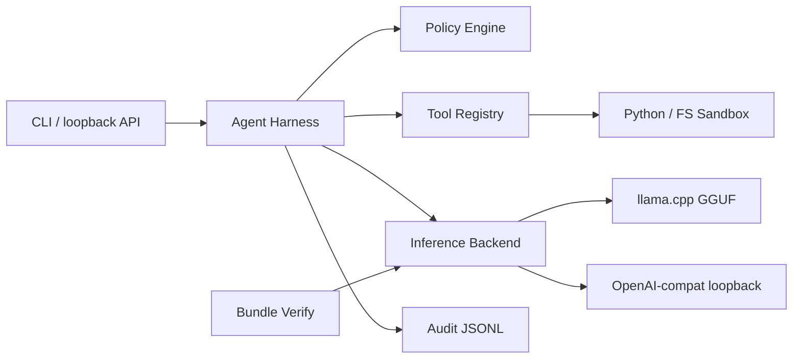

# Airgap Agent

Airgapped, **secure-by-default** deployment and inference harness for **agentic AI** using **open-source models** (GGUF via llama.cpp, or any loopback OpenAI-compatible server).

No cloud APIs, no telemetry, no outbound network at runtime.

## Open source docs

- **Secure startup**: `docs/SECURE_STARTUP.md`
- **Threat model**: `docs/THREAT_MODEL.md`
- **Security policy**: `SECURITY.md`
- **Contributing**: `CONTRIBUTING.md`
- **Code of conduct**: `CODE_OF_CONDUCT.md`
- **Changelog**: `CHANGELOG.md`

## Hardening (red-team remediations)

- **Tool gate**: `TOOL_CALL` must be the first token; JSON parsed with `raw_decode`; schema-validated arguments; allowlist enforced server-side.
- **Injection containment**: Tool/file output wrapped in `<untrusted_tool_result>` and sanitized before model context.
- **Python sandbox**: AST allowlist (no attributes), subprocess isolation (`python -I -S`), timeout.
- **Python sandbox (optional)**: Docker-isolated execution (`--network none`, read-only FS, dropped caps) when `security.python_sandbox.mode: docker` and the image is preloaded.
- **Filesystem**: Symlink rejection, path traversal blocked, bounded reads/list/search.
- **API**: Loopback `serve` requires bundle/policy bootstrap parity with `run`; Bearer token via `AIRGAP_API_TOKEN` by default.
- **Audit**: Hash chain restored across encrypted lines when key is present; chain verified on restore.
- **Dev mode**: Blocked under `/etc/airgap-agent` and `/var/lib/airgap-agent` unless `AIRGAP_ALLOW_DEV=1`.
- **Budgets (per-run)**: total tool calls, total bytes read, and total python execs are capped (defense-in-depth against DoS and over-broad scanning).
- **Canaries**: run `airgap-agent canary` against your configured backend to catch parser/prompt regressions.

## Security model

| Control | Default |
|--------|---------|
| Network egress | Denied (policy + no HTTP tools) |
| Inference endpoint | Loopback only (`127.0.0.1`) |
| Tools | Allowlist: `read_file`, `list_directory`, `search_text`, `run_python` |
| Filesystem | Workspace jail; path traversal blocked |
| Python tool | AST allowlist + subprocess isolation (`python -I -S`) + timeout; optional Docker isolation |
| Models | SHA-256 manifest + **Ed25519 signature** (public key only on deploy) |
| Policy | **Signed** YAML; unsigned policy rejected in strict mode |
| Audit | **Hash-chained** JSONL; optional **ChaCha20-Poly1305** encryption at rest |
| Agent loop | Hard cap on iterations |

## Cryptography (trustless verification)

Third parties can verify artifacts **without trusting the runtime host** — only your offline public keys.

| Artifact | Integrity | Authenticity | Verify command |
|----------|-----------|--------------|----------------|
| Model bundle | SHA-256 per file | Ed25519 over manifest digest | `airgap-agent verify-bundle --trust-dir ./trust` |
| Policy | SHA-256 | Ed25519 detached sig | `airgap-agent verify-policy policies/default.yaml` |
| Audit log | Hash chain per entry | *(no signer — tamper-evident)* | `airgap-agent verify-audit /var/log/.../audit.jsonl` |
| Audit (sensitive) | Same chain inside ciphertext | AEAD key (env only) | `verify-audit --decrypt` with `AIRGAP_AUDIT_ENCRYPTION_KEY` |

### Staging: generate keys and sign (connected machine only)

```bash
airgap-agent keys --out ./release-keys --key-id prod-2025
# Deploy trust/prod-2025.pub.pem to /etc/airgap-agent/trust/ on airgapped hosts.
# Keep signing/prod-2025.pem offline; never copy to airgap.

./scripts/sign-bundle.sh ./models ./release-keys/signing/prod-2025.pem prod-2025
airgap-agent sign-file policies/default.yaml -k ./release-keys/signing/prod-2025.pem --key-id prod-2025
```

### Airgapped host: verify before run

```bash
sudo cp trust/*.pub.pem /etc/airgap-agent/trust/
airgap-agent verify-bundle --models-dir /var/lib/airgap-agent/models --trust-dir /etc/airgap-agent/trust
airgap-agent verify-policy policies/default.yaml --trust-dir /etc/airgap-agent/trust
airgap-agent run "Your task"
airgap-agent verify-audit /var/log/airgap-agent/audit.jsonl
```

Optional encrypted audit (32-byte key as 64-char hex):

```bash
export AIRGAP_AUDIT_ENCRYPTION_KEY=$(openssl rand -hex 32)
export AIRGAP_AUDIT__ENCRYPT_AT_REST=true
```

## Quick start (dev, mock backend)

```bash
python -m venv .venv
source .venv/bin/activate
pip install -e ".[dev]"
mkdir -p workspace models .airgap
echo '{"note": "hello"}' > workspace/note.txt

airgap-agent run "List files in the workspace and summarize note.txt" --dev
airgap-agent health --dev
```

## Docker-isolated Python tool (recommended for production)

By default, `run_python` executes in a restricted subprocess. For stronger isolation, run it inside Docker.

1) Preload the image on the host (connected staging, then transfer if needed):

```bash
docker pull python:3.12-slim
```

2) Enable Docker mode in `config/default.yaml` (or env overrides):

```yaml
security:
  python_sandbox:
    mode: docker
    docker_image: python:3.12-slim
```

This runs the python tool with:
- `--network none`
- `--read-only`
- `--cap-drop ALL`
- `--security-opt no-new-privileges`
- workspace mounted read-only at `/ws`

## Production airgapped flow

### 1. On a connected staging machine — bundle models

Copy GGUF weights into `models/` (e.g. Mistral, Llama, Qwen — your choice), then:

```bash
./scripts/bundle-models.sh ./models
```

#### Option: select models from Hugging Face Hub (connected staging only)

Install the optional Hub dependency:

```bash
pip install -e ".[hf]"
```

Download a GGUF model repo (examples use patterns to avoid pulling unnecessary files):

```bash
airgap-agent hf-download "TheBloke/Mistral-7B-Instruct-v0.2-GGUF" \
  --models-dir ./models \
  --pattern "*.gguf" \
  --pattern "*Q4_K_M.gguf"
```

This writes `models/HF_SOURCE.json` with the upstream repo/revision/commit used, and the bundle manifest/signature then makes the resulting transfer **verifiable**.

Sign the bundle, then transfer `models/`, `MANIFEST.sha256`, `MANIFEST.sig.json`, and `trust/*.pub.pem` to the isolated host (USB, sneakernet, etc.):

```bash
./scripts/sign-bundle.sh ./models ./release-keys/signing/prod-2025.pem prod-2025
```

### 2. On the airgapped host — verify and run

```bash
pip install -e ".[llama]"
export AIRGAP_INFERENCE__BACKEND=llama_cpp
export AIRGAP_INFERENCE__MODEL_PATH=/var/lib/airgap-agent/models/your-model.gguf

airgap-agent verify-bundle --models-dir /var/lib/airgap-agent/models
airgap-agent health
airgap-agent run "Analyze logs in workspace and propose remediation steps"
```

### 3. Optional: local OpenAI-compatible server

If you run **vLLM** or **llama.cpp server** on loopback:

```yaml
inference:
  backend: openai_compat
  base_url: "http://127.0.0.1:8080/v1"
```

```bash
export AIRGAP_INFERENCE__BACKEND=openai_compat
airgap-agent run "Your task"
```

### 4. Loopback HTTP API

```bash
airgap-agent serve --host 127.0.0.1 --port 8741 --dev

curl -s http://127.0.0.1:8741/health | jq .
curl -s -X POST http://127.0.0.1:8741/v1/agent/run \
  -H 'Content-Type: application/json' \
  -d '{"task":"List workspace files"}' | jq .
```

#### Loopback API: signed capability tokens (recommended)

The API can enforce two layers:
- **Bearer auth** (`AIRGAP_API_TOKEN`)
- **HMAC-signed per-request capability token** (`AIRGAP_API_HMAC_KEY` + `X-Airgap-Capability-Token`)

Example:

```bash
export AIRGAP_API_TOKEN=$(openssl rand -hex 32)
export AIRGAP_API_HMAC_KEY=$(openssl rand -hex 32)

airgap-agent serve --host 127.0.0.1 --port 8741

CAP_TOKEN=$(airgap-agent mint-token --cap fs.read --cap fs.list --ttl 300 --max-read-bytes 1048576)

curl -s -X POST http://127.0.0.1:8741/v1/agent/run \
  -H "Authorization: Bearer $AIRGAP_API_TOKEN" \
  -H "X-Airgap-Capability-Token: $CAP_TOKEN" \
  -H 'Content-Type: application/json' \
  -d '{"task":"List workspace files"}' | jq .
```

## Docker (offline runtime)

Build on a connected machine, save the image, load on the isolated host:

```bash
docker build -t airgap-agent:0.1.0 .
docker save airgap-agent:0.1.0 | gzip > airgap-agent-0.1.0.tar.gz
# transfer tar.gz, then on airgapped host:
docker load < airgap-agent-0.1.0.tar.gz
docker compose -f docker-compose.airgap.yml up
```

Mount models read-only and a dedicated workspace volume.

## Configuration

See [`config/default.yaml`](config/default.yaml). Override with env vars (`AIRGAP_INFERENCE__BACKEND`, etc.) or `--config`.

Policies: [`policies/default.yaml`](policies/default.yaml).

## Architecture



## License

Apache-2.0
